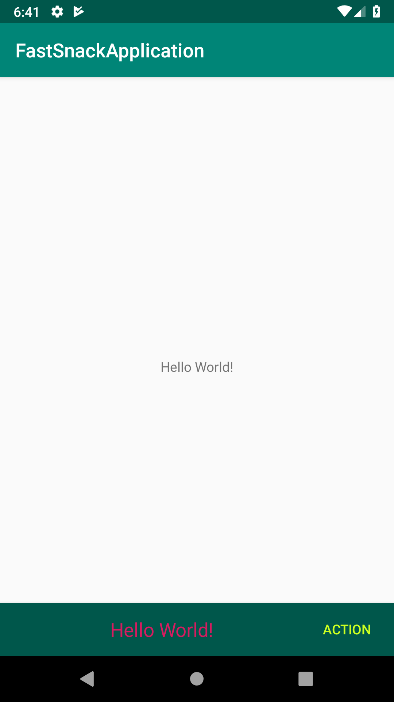
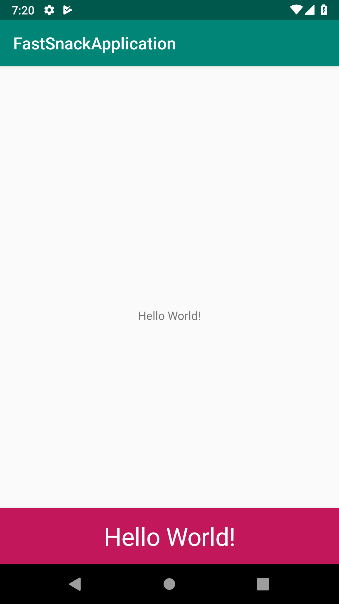
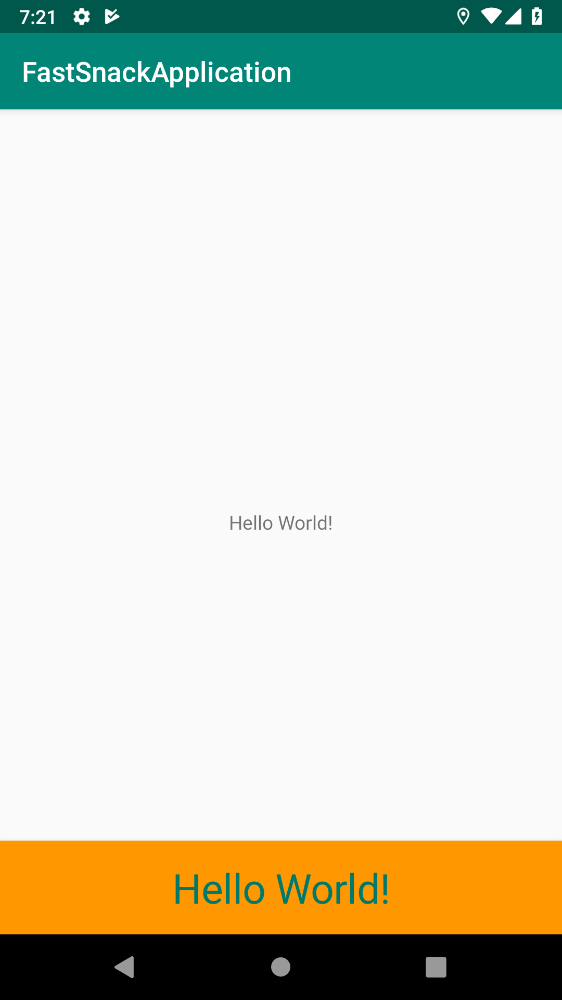

# FastSnack
[](https://jitpack.io/#softrunapp/fastsnack)

Android FastSnack library as snackbar

Quickly show snakbar in the application and apply default values for it.

## Preview







## Gradle

Add it in your root build.gradle at the end of repositories:


    allprojects {
        repositories {
            jcenter()
            maven { url "https://jitpack.io" }
        }
    }
Add the dependency:

	dependencies {
	        implementation 'com.github.softrunapp:fastsnack:1.0.0'
	}


## Usage
Using FastSnack is really simple.

Use one of below in the `onCreate` of your activity.

```java
    FastSnack.on(this).message("Hello World!").show();
```

```java
    FastSnack.on(findViewById(R.id.root)).message("Hello World!").show();
```

```java
    FastSnack.on(this,R.id.root).message("Hello World!").show();
```


## Customization
most of them are self-explaining

```java
    FastSnack.on(this).message("Hello World!")
            .textColor(getColor(R.color.colorAccent))
            .textSize(20)
            .textGravity(Gravity.CENTER)
            .textAlignment(View.TEXT_ALIGNMENT_CENTER)
            .backgroundColor(getColor(R.color.colorPrimaryDark))
            .duration(FastSnack.LENGTH_LONG) // set duration time
            .typeFace(typeface) // set custom font
            .setActionListener("action", new View.OnClickListener() {
                @Override
                public void onClick(View v) {
                    // your action
                }
            })
            .setActionTextColor(Color.parseColor("#ccff21"))
            .show();
```
## Default valuse
Add this snippet in the onCreate of your applicaton class or first activity

```java
    FastSnackConfigs.buildDefaults()
            .setTextColor(getColor(R.color.colorAccent))
            .setTextSize(18)
            .setTextGravity(Gravity.LEFT)
            .setTextAlignment(View.TEXT_ALIGNMENT_TEXT_END)
            .setBackgroundColor(getColor(R.color.colorPrimaryDark))
            .setDuration(FastSnack.LENGTH_SHORT)
            .setTypeface(typeface)
            .setActionTextColor(getColor(R.color.blue));
```

